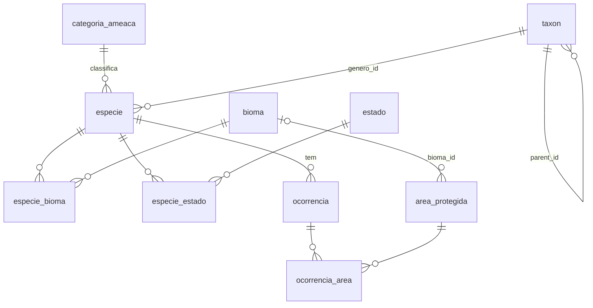
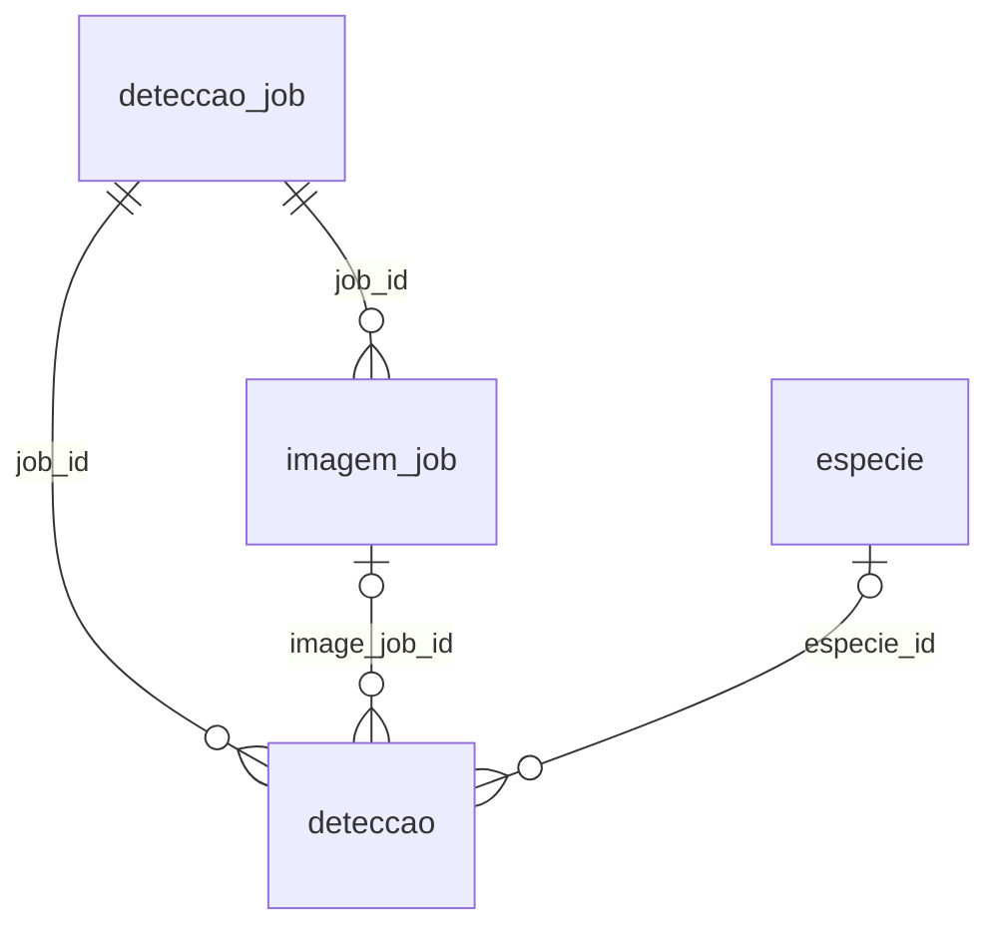

# BioGuardians — Modelo Entidade-Relacionamento (ERD)

Entidades, relacionamentos e cardinalidades do schema atual (migrations `001`–`004`).
Colunas e tipos detalhados em `DATA_DICTIONARY.md`.

---

## Domínio principal

- `ocorrencia_area` materializa a relação espacial `ST_Contains(area.geom, ocorrencia.geom)`
  e é mantida por triggers.
- `log_auditoria` recebe uma linha por INSERT/UPDATE/DELETE em `especie` e
  `area_protegida` (via trigger, sem FK).

## ML service

- `modelo_ml` é um registro independente de modelos treinados (sem FK).
- Detecções aceitas geram `especie` (se nova) e `ocorrencia` com `fonte = 'camera_trap'`
  ou `'deteccao_ia'` — a ligação é feita pelo ML service, não por FK.

## Tabelas de suporte (sem relacionamentos)

- `area_tile` — tiles MVT pré-gerados das UCs, chave `(z, x, y)`
- `cache_metadata` — marca de última alteração por domínio (atualizada por trigger)
- `schema_migrations` — journal do `migrate.sh`

---

## Entidades e Relacionamentos

### 1. `categoria_ameaca` ↔ `especie` (1:N)

- Uma categoria de ameaça classifica **muitas** espécies.
- Uma espécie tem **exatamente uma** categoria de ameaça.
- FK: `especie.categoria_ameaca → categoria_ameaca.codigo` (ON DELETE RESTRICT, ON UPDATE CASCADE)

### 2. `taxon` ↔ `especie` (1:N via gênero)

- Um táxon de rank `genero` classifica **muitas** espécies.
- Uma espécie pertence a **exatamente um** gênero.
- FK: `especie.genero_id → taxon(id)` (ON DELETE RESTRICT)

### 3. `taxon` ↔ `taxon` (auto-referência, 1:N)

- Um táxon pai tem **muitos** táxons filhos.
- Um táxon filho tem **um** táxon pai (ou NULL para reino).
- FK: `taxon.parent_id → taxon(id)` (ON DELETE RESTRICT)

Hierarquia: `reino → filo → classe → ordem → familia → genero`

### 4. `especie` ↔ `bioma` (N:N)

- Tabela de junção: `especie_bioma(especie_id, bioma_id)`
- FKs: `especie_id → especie(id) ON DELETE CASCADE`, `bioma_id → bioma(id) ON DELETE RESTRICT`

### 5. `especie` ↔ `estado` (N:N)

- Tabela de junção: `especie_estado(especie_id, estado_uf)`
- FKs: `especie_id → especie(id) ON DELETE CASCADE`, `estado_uf → estado(uf) ON DELETE RESTRICT`

### 6. `bioma` ↔ `area_protegida` (1:N)

- Uma área protegida está em **um** bioma (ou NULL).
- FK: `area_protegida.bioma_id → bioma(id)` (ON DELETE SET NULL)

### 7. `especie` ↔ `ocorrencia` (1:N)

- Uma ocorrência refere-se a **exatamente uma** espécie.
- FK: `ocorrencia.especie_id → especie(id)` (ON DELETE CASCADE)

### 8. `area_protegida` ↔ `ocorrencia` (N:N espacial, materializada)

- Uma área contém **muitas** ocorrências; uma ocorrência pode cair em **zero ou mais**
  áreas (UCs se sobrepõem).
- Tabela de junção: `ocorrencia_area(ocorrencia_id, area_id)`, ambas FKs `ON DELETE CASCADE`.
- Triggers recalculam a junção quando a ocorrência é criada/movida
  (`trg_ocorrencia_areas`) ou quando a geometria da área muda (`trg_area_ocorrencias`).
- Consultas (`especies_em_area`, `areas_protegem_especie`, `especies_por_uc`) fazem
  JOIN por inteiros, sem `ST_Contains` na leitura.

### 9. `especie` / `area_protegida` → `log_auditoria` (via trigger)

- Toda operação INSERT/UPDATE/DELETE gera **uma** entrada em `log_auditoria`.
- Trigger: `trg_auditar()` (AFTER INSERT/UPDATE/DELETE, FOR EACH ROW).
- Captura `dados_anteriores` (JSONB do OLD) e `dados_novos` (JSONB do NEW).

### 10. `deteccao_job` ↔ `imagem_job` / `deteccao` (1:N)

- Um job tem **muitas** imagens e **muitas** detecções (ON DELETE CASCADE).
- `imagem_job` é único por `(source, source_image_id)` — checkpoint idempotente.
- `deteccao.image_job_id → imagem_job(id)` e `deteccao.especie_id → especie(id)`,
  ambos ON DELETE SET NULL.

---

## Cardinalidade Resumida

| Entidade 1 | Relação | Entidade 2 | Cardinalidade | Mecanismo |
|------------|---------|------------|---------------|-----------|
| categoria_ameaca | classifica | especie | 1:N | FK |
| taxon (genero) | classifica | especie | 1:N | FK |
| taxon (pai) | contém | taxon (filho) | 1:N | auto-ref FK |
| especie | ocorre em | bioma | N:N | tabela join |
| especie | ocorre em | estado | N:N | tabela join |
| bioma | contém | area_protegida | 1:N | FK SET NULL |
| especie | tem | ocorrencia | 1:N | FK CASCADE |
| area_protegida | contém | ocorrencia | N:N | `ocorrencia_area` (trigger) |
| especie/area | audita | log_auditoria | 1:N | trigger |
| deteccao_job | processa | imagem_job | 1:N | FK CASCADE |
| deteccao_job | gera | deteccao | 1:N | FK CASCADE |
| imagem_job | origina | deteccao | 1:N | FK SET NULL |
| especie | identificada em | deteccao | 1:N | FK SET NULL |

---

## Índices

| Índice | Tabela | Tipo | Coluna(s) | Propósito |
|--------|--------|------|-----------|-----------|
| `idx_area_protegida_geom` | area_protegida | GIST | geom | Consultas espaciais / tiles |
| `idx_ocorrencia_geom` | ocorrencia | GIST | geom | Consultas espaciais / tiles |
| `idx_ocorrencia_geom_validos` | ocorrencia | GIST (parcial) | geom `WHERE geom IS NOT NULL` | Join espacial |
| `idx_deteccao_geom` | deteccao | GIST | geom | Buscas geográficas de detecções |
| `idx_especie_busca_fts` | especie | GIN | tsv_busca | Full-text search |
| `idx_especie_categoria` | especie | B-tree | categoria_ameaca | Filtro por categoria |
| `idx_especie_status` | especie | B-tree | status | Filtro por status |
| `idx_especie_cat_status` | especie | B-tree | (categoria_ameaca, status) | Filtro combinado |
| `idx_especie_nome_popular` | especie | B-tree | nome_popular | Ordenação/busca por nome |
| `idx_especie_imagem_url` | especie | B-tree (parcial) | id `WHERE imagem_url IS NULL` | Espécies sem imagem (enriquecimento) |
| `idx_area_protegida_esfera` | area_protegida | B-tree | esfera | Filtro por esfera |
| `idx_area_protegida_categoria` | area_protegida | B-tree | categoria_uc | Filtro por categoria |
| `idx_area_protegida_bioma` | area_protegida | B-tree | bioma_id | Filtro por bioma |
| `idx_ocorrencia_especie` | ocorrencia | B-tree | especie_id | Join com especie |
| `idx_ocorrencia_especie_data` | ocorrencia | B-tree | (especie_id, data_evento DESC) | Ocorrências recentes por espécie |
| `idx_ocorrencia_fonte` | ocorrencia | B-tree | fonte | Filtro por fonte |
| `idx_ocorrencia_data` | ocorrencia | B-tree | data_evento | Filtro por data |
| `idx_ocorrencia_area_area` | ocorrencia_area | B-tree | area_id | Ocorrências por UC (PK cobre ocorrencia_id) |
| `idx_taxon_parent` | taxon | B-tree | parent_id | Navegação hierárquica |
| `idx_taxon_rank` | taxon | B-tree | rank | Filtro por rank |
| `idx_log_tabela_ts` | log_auditoria | B-tree | (tabela, timestamp DESC) | Consulta de log |
| `idx_deteccao_job` | deteccao | B-tree | job_id | Detecções do job |
| `idx_deteccao_especie` | deteccao | B-tree (parcial) | especie_id `WHERE NOT NULL` | Detecções por espécie |
| `idx_deteccao_metodo` / `idx_deteccao_status` | deteccao | B-tree | metodo_classificacao / status | Filtros |
| `idx_deteccao_image_job` | deteccao | B-tree (parcial) | image_job_id `WHERE NOT NULL` | Join com imagem_job |
| `idx_deteccao_job_status` | deteccao_job | B-tree | (status, criado_em DESC) | Fila de jobs |
| `idx_deteccao_job_source` | deteccao_job | B-tree | (source, status, criado_em DESC) | Jobs por origem |
| `idx_imagem_job_job` / `idx_imagem_job_status` | imagem_job | B-tree | job_id / status | Progresso do job |
| `idx_imagem_job_hash` | imagem_job | B-tree (parcial) | image_hash `WHERE NOT NULL` | Dedup por hash |

As views materializadas têm índices únicos próprios (`idx_dashboard_stats_unico`,
`idx_especies_por_uc_pk`, `idx_ranking_categoria`, `idx_ucs_por_esfera`).
